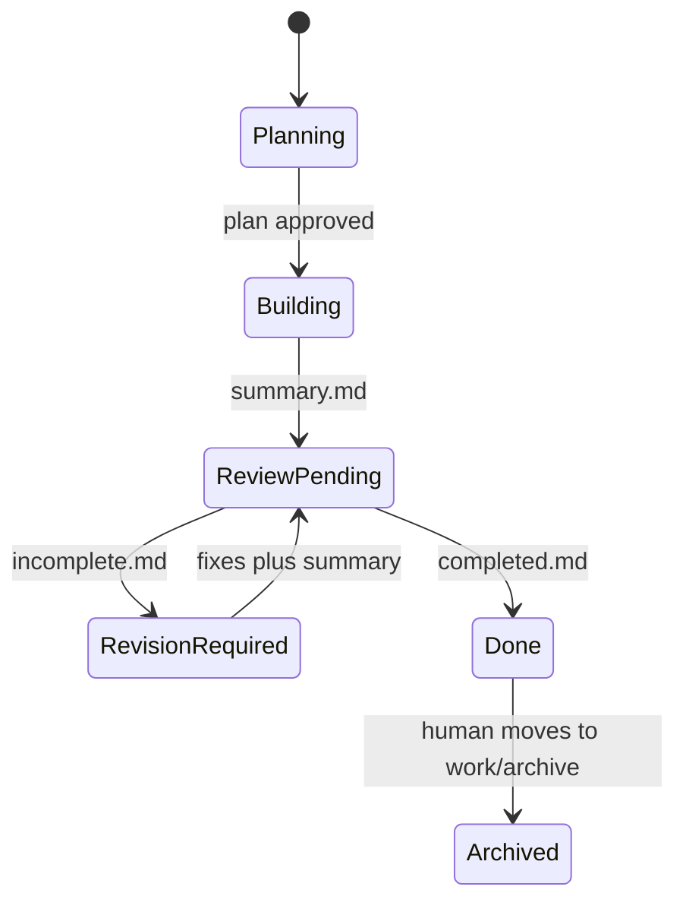

# Workflow

Operational detail lives in [brain/process.md](../brain/process.md). This page is the map.

## Current iteration

Lowest-numbered `work/NNNN-slug/` that is **not** under `work/archive/`.

No such folder → nothing is in flight. Engineer (or you) creates the next number.

## File-as-signal

```
spec.md only                    PLANNING     Worker writes plan, waits
plan.md + human said go         BUILDING     Worker implements
summary.md                      REVIEW_PENDING   Foreman (review profile)
incomplete.md                   REVISION_REQUIRED  Worker fixes, deletes incomplete.md
completed.md                    DONE         Human archives; agents stop
```

There is no status database. Presence of files *is* the state.

## The loop

1. **Seed (human or Engineer).** Requirement in `spec.md`. The agent does not invent the work.
2. **Plan (Worker).** `plan.md`, then stop for approval.
3. **Build (Worker).** Body changes + `summary.md`.
4. **Critique (Foreman, default profile).** `completed.md` or `incomplete.md`.
5. **Sign-off (human).** `mv work/NNNN-slug work/archive/NNNN-slug`.



## Blocking sign-off

`completed.md` in a non-archived folder is a hard stop. Agents request the `mv`, do not start `NNNN+1`, and repeat the request at the top of every response until you archive.

A chat “LGTM” is not archive.

## Structural integrity

If the work would violate [constitution](../brain/constitution.md) or [architecture](../brain/architecture.md), the correct move is to **edit the brain first**, then continue. Skipping that is how agents invent a different project.

## Profiles

[review](../profiles/review.md) (default) requires Foreman. [solo](../profiles/solo.md) lets you archive after `summary.md`. [docs](../profiles/docs.md) is the same loop with Writer/Editor names and doc checks. Declare the profile in `AGENTS.md`.
